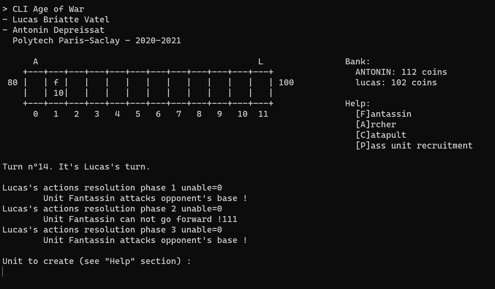

# CLIAgeOfWar

Advanced C++ project - Polytech ET4 IT - Noted for S7 (2020-2021)

## Asked work

- [Game rules and project subject](./doc/Projet_C++_TP.pdf) :fr:

All remaining bugs and unimplemented features are listed [here](https://github.com/0xWryth/CLIAgeOfWar/issues).

## Getting Started

These instructions will get you a copy of the project up and running on your local machine for development purpose.

### Prerequisites

Things you need to install the project :

- [gcc](https://gcc.gnu.org/)
- [make](http://www.gnu.org/software/make/)

### Running

Here are some instructions on how to get the development env running.

First, clone this repository with the following command :

#### `git clone https://github.com/0xWryth/CLIAgeOfWar`

Then build & run the executable `./out/main` from source code using :

#### `make run`

or

#### `make clean run`

to delete the executable file and all the object files from the directory before.

### How to play

This mini-game is inspired by Age of War, which is played with two people (human against AI).
Here, it is a turn-based adaptation of this game with a "human vs human" mode and a "human vs AI" mode.

* The playing area is a line of 12 squares numbered from 0 to 11.
* Each player has his base at the end of the game board.
* The goal is to destroy the opponent's base.

To do this, each player can create a unit on the square of his base once per round.

* The unit can then advance, attack other units or the opposing base.
* Depending on its type, a unit costs a certain amount of gold coins, has a certain range, health and attack points.
* On each turn, players earn 8 gold coins.
* For more subtle rules (how to obtain super-soldier, how to earn extra gold from combat, ...) please refer to the [subject](./doc/Projet_C++_TP.pdf).

---

### Authors

* **Lucas B.** - *Code structure, console display, input processing, ...* - @0xWryth
* **Antonin D.** - *Documentation, input processing, action resolution phases...* - @adepreis

---

## Documentation

In the `/doc` folder, you can find a brief report that explains the design choices and which contains the class diagram, screenshots...

